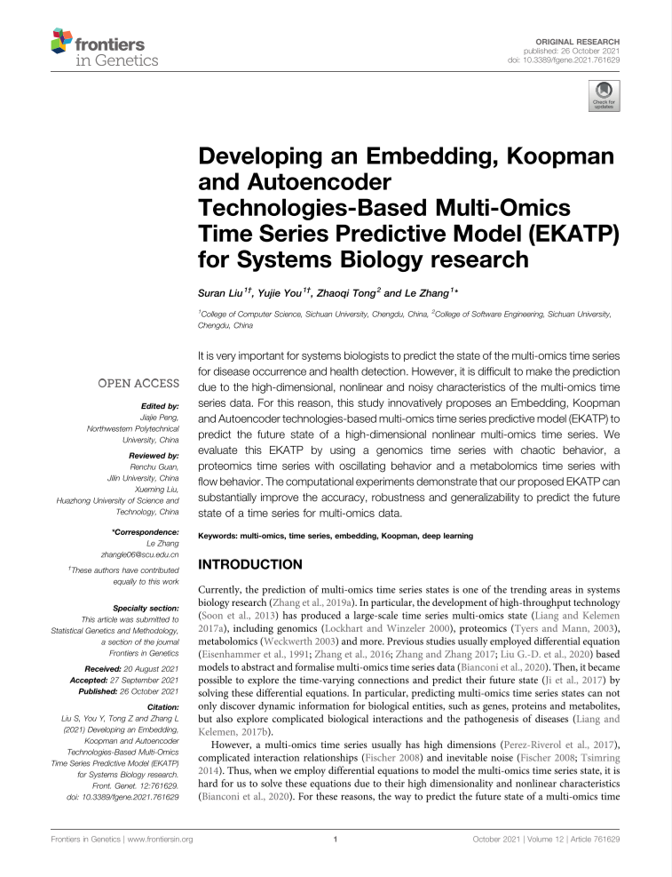

# EKATP_Flask

## 项目概述

基于EKATP模型的高维非线性时间序列数据预测Web应用。

## 运行方式

运行app.py脚本文件即可。

### 运行环境

- Windows 10
- Python 3.8
- PyTorch 1.5.1+CPU

## 项目支持

**四川大学大学生创新创业大赛省级项目**

感谢**四川大学软件学院**提供的支持与帮助。

## 项目论文

项目组在《Frontiers in Genetics》上发布SCI论文《Developing an Embedding, Koopman and Autoencoder Technologies-Based Multi-Omics Time Series Predictive Model (EKATP) for Systems Biology research》。

论文网址：https://www.frontiersin.org/articles/10.3389/fgene.2021.761629/full

论文代码：https://github.com/suranl/EKATP

论文doi：https://doi.org/10.3389/fgene.2021.761629

Frontiers in Genetics影响因子：3.599

